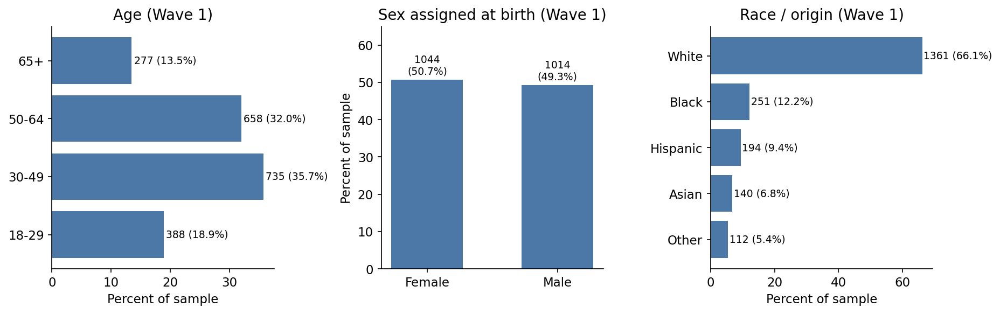
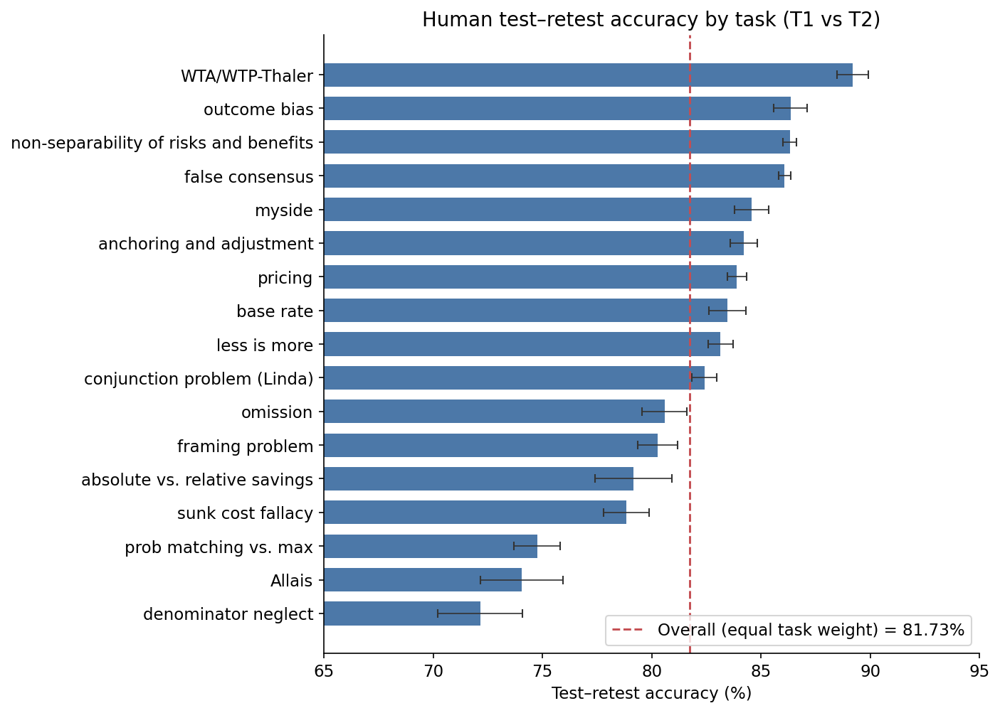
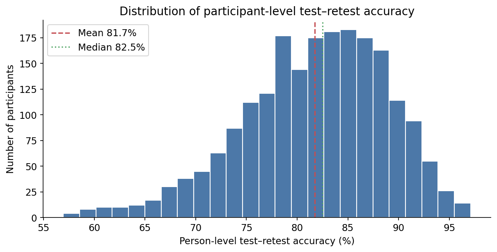

# Twin-2K-500 data exploration report

Deliverable 1 only. All statistics below were computed from the local `data/` files. The reproducing notebook is [`notebooks/01_data_exploration.ipynb`](../notebooks/01_data_exploration.ipynb); helpers are in `src/data_utils.py` and `src/evaluation_utils.py`. Raw files under `data/` were not modified.

## 1. Executive summary

- **N = 2,058** people. IDs `1…2058` match across persona JSON, T1/T2 answer blocks, persona summaries, and all four wave CSVs.
- **Prediction setup:** condition on waves 1–3 *non-holdout* answers (persona); predict the same person’s answers on **repeated** hold-out tasks. Wave 4 is a retest of the same tasks and conditions, not an independent new test set.
- **Human test–retest (headline):** **81.73%** equal-task-weight accuracy (mean of 17 task means). Person-level 95% CI: **81.42–82.04%**. The paper reports 81.72%; the 0.01pp gap is a rounding/validation check, not our source.
- **Task reliability is uneven:** 72.2% (denominator neglect) to 89.2% (WTA/WTP). Person-level IQR ≈ 77–87%.
- **Sample:** US adults, Prolific, quota targeting on age/sex/ethnicity; this release is **four-wave completers only**. Attrition cannot be measured from these files.

## 2. Dataset structure

Two Hugging Face configs are written locally by `download_dataset.py`.

| Representation | Count | Role | Location |
|---|---|---|---|
| `wave1_3_persona_json` | 2,058 | Waves 1–3 non-holdout Q&A → persona / model input | `data/mega_persona_json/mega_persona/` |
| `wave4_Q_wave1_3_A` (**T1**) | 2,058 | Hold-out tasks with original (waves 1–3) answers | `data/mega_persona_json/answer_blocks/` |
| `wave4_Q_wave4_A` (**T2**) | 2,058 | Same tasks, Wave 4 repeated answers | same |
| `persona_summary` | 2,058 | Prose summary (optional encoding) | `data/mega_persona_summary_text/` |
| Raw Qualtrics CSVs | 8 files | Labels + numeric codes, four waves | `data/wave_csv/` |

```
Waves 1–3 non-holdout responses  →  persona / model input
Held-out answers at original administration  →  T1
Same tasks / conditions repeated in Wave 4   →  T2
T1 vs T2  →  human test–retest reliability
```

PID sets are identical. IDs are consecutive `1…2058`.

## 3. Raw CSVs

Each `*_anonymized.csv` is a Qualtrics export: row 0 = names, row 1 = question labels, row 2 = `ImportId` JSON, row 3+ = people. After skipping the two metadata rows, every wave has **2,058** rows, **0** duplicate `TWIN_ID`s, **0** missing IDs, all `Finished=TRUE`.

`*_labels_anonymized.csv` stores category text; `*_numbers_anonymized.csv` stores the same columns as codes (e.g. Female/Male → 2/1; Likert “Agree a little” → 4). Codes are option positions, not continuous measurements, unless the item is numeric.

Wave 1 launched timestamps start 2025-01-29; Wave 4 starts 2025-02-25 — consistent with the paper’s one-to-four-week panel.

## 4. Persona JSON

Persona files are a list of **blocks**, each with **question objects**. A Matrix object can contain many row-level items. Do not equate JSON-object count with “~500 questions.”

| | Typical persona | T1 hold-out block |
|---|---|---|
| Blocks | 13 (2,052 people); 12 for 6 people | 18 (all) |
| JSON question objects | 172 (2,019 people); 170–171 otherwise | 64 (all) |
| Non-DB objects | ~158 | — |
| Item-level responses | **537** (mean 536.98; range 535–537) | 94 or 98 (matching problem 1 vs 2) |

Question types in the files: **MC, Matrix, TE, DB** in persona JSON; hold-out blocks also have **Slider**.

Answers: MC/Matrix use `SelectedByPosition` + `SelectedText`; TE uses `Text`; Slider uses `Values`. DB has no answers.

Every T1/T2 pair has **identical question fingerprints** (IDs, types, options, order). They differ only in `Answers`.

## 5. Scoring protocol

Seventeen hold-out tasks (heuristics/biases + 40-item pricing). Between-subject experiments: one variant per person. Implementation: `src/evaluation_utils.py`, following `evaluation/mad_accuracy_evaluation.py` without calling that script.

$$
\mathrm{accuracy} = 1 - \frac{|\hat{y}-y|}{y_{\max}-y_{\min}}
$$

Binary items (range 1) reduce to exact match. Anchoring free-response numbers are unbounded: T1 percentiles define deciles; both T1 and T2 are mapped to 1–10, then scored with range 9.

**Aggregation:** mean items within a task for each person → mean people within a task → **unweighted mean of 17 tasks**. Task-level averaging matters because pricing has 40 items and omission has one. Every completer has all 17 tasks, so the overall number equals the mean of person-level equal-task-weight accuracies.

Worked example: Likert T1=3, T2=5, range 1–5 → $1-|3-5|/4=0.50$.

## 6. Representativeness

Wave 1 labels (`Q11`–`Q24`). Paper: Prolific, US, Wave 1 **targeted** 2,500 people by age, sex, and ethnicity; this file is the **2,058 completers**.

| | Share of 2,058 |
|---|---|
| Female / Male | 50.7% / 49.3% |
| Age 18–29, 30–49, 50–64, 65+ | 18.9%, 35.7%, 32.0%, 13.5% |
| White, Black, Hispanic, Asian, Other | 66.1%, 12.2%, 9.4%, 6.8%, 5.4% |

Other (selected): South 40.5%; college graduate/some postgrad 35.7%; income $100k+ 26.8%; Democrat 41.2% / Independent 29.6% / Republican 26.2%; US citizen 99.8% (4 non-citizens). Full table: `reports/figures/demographics_other.csv`.

This is **quota targeting**, not proof of full US representativeness on education, income, or politics. Non-completers are absent, so attrition bias cannot be estimated here.



## 7. Human test–retest (main result)

T1 = `wave4_Q_wave1_3_A`, T2 = `wave4_Q_wave4_A`. Independently scored; not typed from the paper.

| | Value |
|---|---|
| Overall (equal task weight) | **81.73%** |
| Person-level 95% CI | 81.42–82.04% |
| Paper’s reported figure | 81.72% (0.01pp difference) |
| Person mean / median / sd | 81.73% / 82.49% / 7.16pp |
| 5th, 25th, 75th, 95th | 68.74%, 77.40%, 86.97%, 92.12% |
| Mean items with both T1 and T2 | 94.0 |

**By task** (sorted by reliability; 95% CI across people):

| Task | Accuracy |
|---|---|
| Denominator neglect | 72.2% |
| Allais | 74.1% |
| Probability matching vs. maximizing | 74.8% |
| Sunk cost | 78.8% |
| Absolute vs. relative savings | 79.2% |
| Framing | 80.3% |
| Omission | 80.6% |
| Conjunction (Linda) | 82.4% |
| Less is more | 83.1% |
| Base rate | 83.5% |
| Pricing | 83.9% |
| Anchoring and adjustment | 84.2% |
| Myside | 84.6% |
| False consensus | 86.1% |
| Non-separability of risks and benefits | 86.3% |
| Outcome bias | 86.3% |
| WTA/WTP–Thaler | 89.2% |

Humans are not perfectly self-consistent. A later model should be judged against this **reliability benchmark**, not against 100%. It is a practical ceiling used by the paper, not a strict mathematical upper bound.





## 8. Data quality

| Check | Result | Implication |
|---|---|---|
| Duplicate / missing IDs | None | Completer-only tables |
| PID alignment | Identical `{1…2058}` | No unmatched twins |
| T1 vs T2 structure | 2,058/2,058 identical | Conditions held fixed |
| Persona schema | 6 people with 12 blocks; objects 170–172 | Minor skip-logic, not a broken schema |
| Empty summaries | 0; length ~11.6–18.5k chars | `full_persona` complete |
| Accuracy range | Item accuracies in [0, 1] | Ranges behave as specified |
| Anchoring raw values | e.g. Q166 up to 5,000 | Unbounded by design; scored as deciles |

## 9. Biases and limitations

**(a) In these files.** US-centric items; completer-only sample; coarse bins; short retest window (memory/learning can inflate T1–T2 agreement); large task-level reliability spread.

**(b) From the paper, not re-estimated here.** Prolific quota sample; funnel 2,509 → 2,263 → 2,252 → 2,058; survey ≠ incentivized behavior; social-science / pricing coverage only.

**(c) Implications.** Longer gaps would likely lower test–retest. T1 hold-out answers must not enter the persona. `wave1_3_persona_json` as shipped is the evaluation-safe split.

## 10. Implications for later modeling

1. Evaluation data have intrinsic human temporal variability (~82%, not 100%).
2. Contextualize overall model accuracy against this test–retest number.
3. Report per-task performance; reliability varies substantially.
4. Keep T1 out of the persona.
5. Use the published MAD rule, including anchoring deciles.
6. Personas are long (~537 items, ~13k-character summaries); encoding will matter later.

No model training, fine-tuning, or application design in this deliverable.
