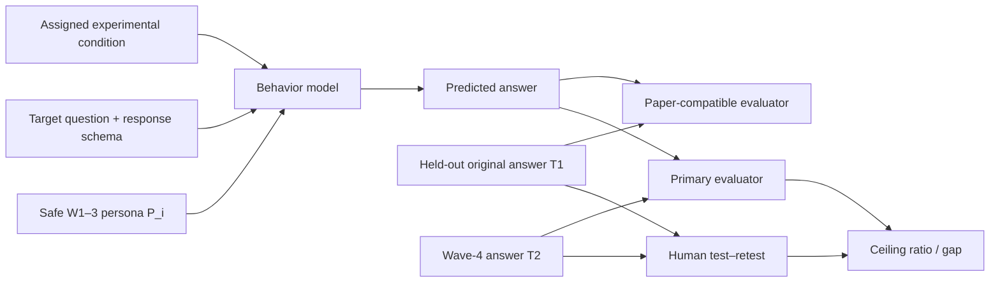
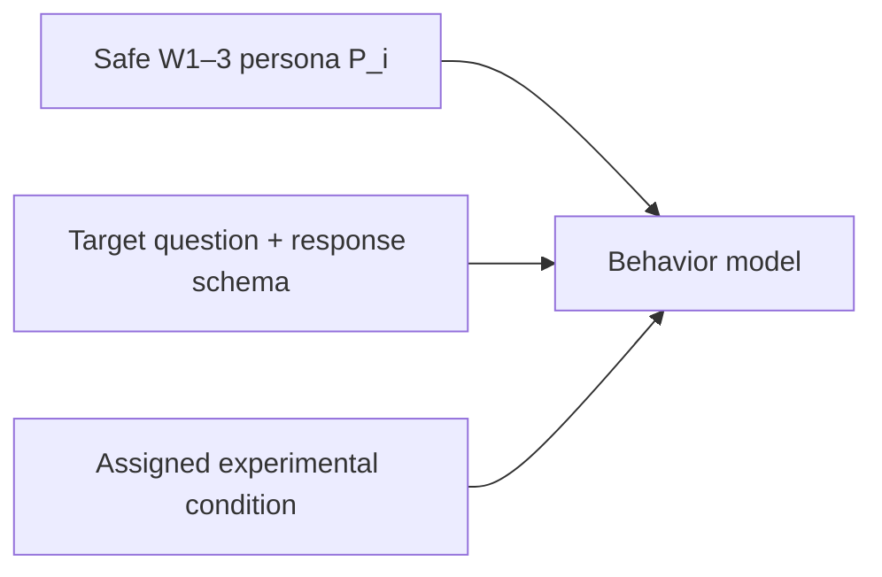
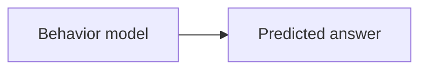
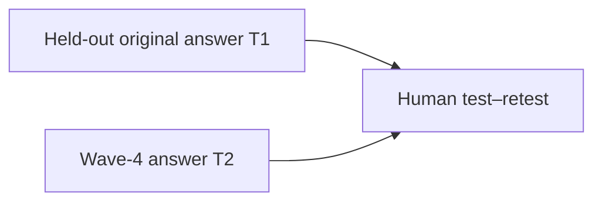
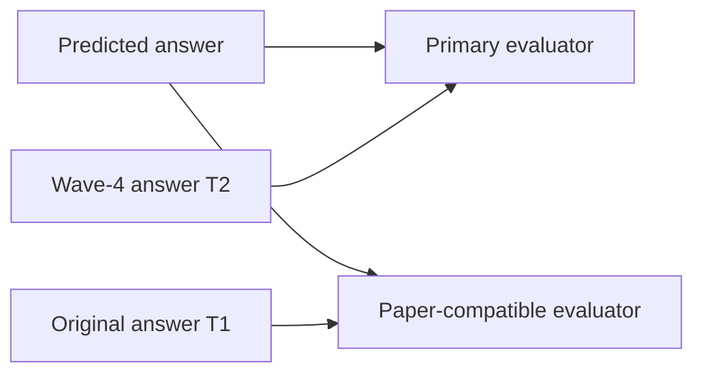
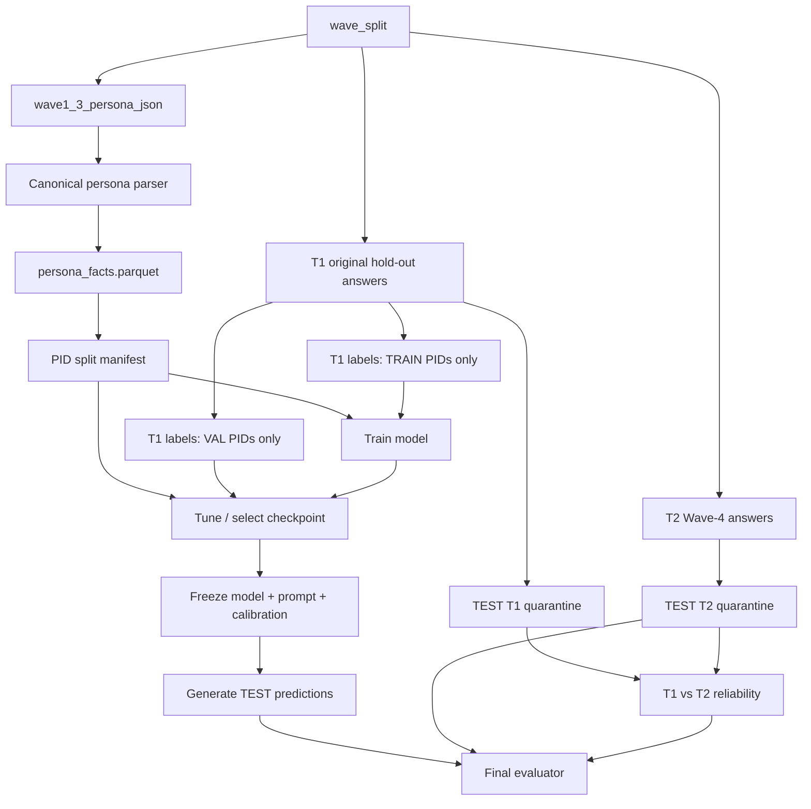
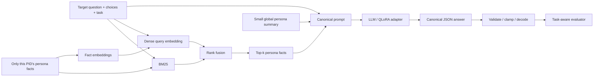

# Technical Design for a Twin-2K-500 Behavior Model

## Executive summary

Twin-2K-500 is unusually well suited to behavior modeling because it combines a rich per-person history with repeated behavioral measurements. The final sample contains 2,058 U.S. participants, each observed across four waves; Waves 1–3 contain more than 500 questions spanning demographics, personality, cognition, economic preferences, heuristics and biases, and pricing, while Wave 4 repeats 88 earlier behavioral/pricing questions under the **same experimental condition** for each participant. 

The core model should implement

$$
p_\theta(y_{i,q}\mid P_i,\;Q_q,\;C_{i,q}),
$$

where $P_i$ is participant $i$'s **leakage-safe Waves 1–3 persona**, $Q_q$ is a target survey question plus its response schema, $C_{i,q}$ is the experimental condition actually shown to that participant, and $y_{i,q}$ is the participant's answer.

My recommendation is **not** to jump directly to a 7B fine-tune. Build a ladder:

| Priority | Approach | Purpose |
|---|---|---|
| Must-have | Random, majority, demographic logistic/XGBoost | Establish how much signal exists without language modeling |
| Must-have | Full-persona GPT-4.1-mini prompting | Paper-compatible strong baseline |
| High | Hybrid sparse+dense RAG + GPT-4.1-mini | Test whether selecting behaviorally relevant history improves fidelity/cost |
| High | RAG + QLoRA on Qwen2.5-1.5B | Main engineerable local LBM |
| MVE / bonus | Qwen2.5-0.5B-Instruct + LoRA/QLoRA | Fits the assignment's <0.5B POC constraint |
| Conditional | Qwen 3B/7B or Mistral 7B QLoRA | Scale only after smaller experiments establish value |
| Experimental | DPO/PEFT on human-chosen vs model-wrong answers | Try only after SFT; the dataset does not contain genuine pairwise preference labels |

The **single most important design decision** is the evaluation contract. The published paper's main LLM benchmark predicts the held-out **original Waves 1–3 answers, T1**, while Wave 4/T2 is used to measure test–retest reliability. The current Hugging Face presentation also naturally supports the assignment's “predict later Wave-4 behavior” framing. The engineering solution is to freeze one participant split and report **both endpoints**, with Wave 4 as the primary future-behavior endpoint and T1 as a paper-compatible secondary endpoint. 

A second critical decision concerns leakage. The current Hugging Face card explicitly says the `full_persona` representation substitutes **Wave-4 responses for questions occurring in both earlier waves and Wave 4**. Consequently, `full_persona.persona_text` and `persona_json` are **not valid inputs** for a leakage-safe Wave-4 prediction experiment. `persona_summary` should also be regarded as untrusted for the primary benchmark unless its generation provenance is audited. Use `wave1_3_persona_json`, or generate your own summary strictly from it. 

The recommended main experiment is therefore:

> **70/15/15 participant split → leakage-safe persona parser → hybrid retrieval → Qwen2.5-1.5B QLoRA → canonical typed answer → task-aware evaluation against Wave-4 test answers → compare with the same test participants' T1↔T2 human reliability.**


## Problem Statement and Evaluation Protocol

### The prediction problem

For person $i$, define the safe persona as

$$P_i = \left \{ (q_j, a_{i,j}, m_j):j\in \text{non-holdout Waves 1--3} \right\},$$

where $q_j$ is the historical question, $a_{i,j}$ is that participant's answer, and $m_j$ contains question type, scale, matrix row, and other metadata.

For an evaluation item $q$,

$$X_{i,q} = (P_i,\ Q_q,\ C_{i,q},\ S_q),$$

where:

- $Q_q$: question/stimulus text;
- $C_{i,q}$: participant's assigned experimental condition;
- $S_q$: answer schema: choices, range, slider bounds, ordinal scale, etc.;
- $P_i$: **never contains that person's earlier answer to the evaluation item**.

The model should ideally return both a hard answer and, where possible, a probability distribution:

$$ f_\theta(X_{i,q})= \left(\hat y_{i,q}, p_\theta(y\mid X_{i,q})\right).$$

The hard answer is used for the paper-style predictive score. Probabilities are useful for calibration, uncertainty analysis, and population-level stochastic simulation.

### Use two explicitly named evaluation endpoints

The paper says that the heuristic/bias answers from Waves 1–3 are held out from the persona and used as the **ground truth for digital-twin prediction**, with Wave 4 used for the human test–retest benchmark. The paper's GPT-4.1-mini result is therefore 71.72% against T1, compared with 81.72% human test–retest and 59.17% random guessing. 

This assignment, however, frames the practical task as predicting how the same person answers the held-out **Wave-4** questions. The cleanest implementation is:

**Primary: future-behavior endpoint**

$$ M_{\text{future}} = \text{Score} \left(\hat y^{T2}_{\text{test}}, y^{T2}_{\text{test}} \right).$$

The model may learn from T1 labels belonging to **training participants**, but it must not receive T1 labels from validation/test participants as persona inputs.

**Secondary: paper-compatible endpoint**

After the model, prompt, hyperparameters, calibrators, and all predictions are frozen:

$$M_{\text{paper}} = \text{Score} \left(\hat y_{\text{test}}, y^{T1}_{\text{test}} \right).$$

This provides a bridge to the published 71.72% GPT-4.1-mini result. 

**Human reliability benchmark**

For the same held-out test PIDs:

$$H_{\text{test}} = \text{Score} \left(y^{T1}_{\text{test}}, y^{T2}_{\text{test}} \right).$$

Then report:

$$R_{\text{ceiling}} = \frac{M_{\text{future}}}{H_{\text{test}}}$$

and

$$G_{\text{ceiling}} = H_{\text{test}}-M_{\text{future}}.$$

Call $H$ a **human reliability benchmark** or **practical ceiling**, not a strict mathematical upper bound. A model could theoretically exceed it if T2 contains random temporal noise.

### Per-item and per-task scoring

The evaluator should be one frozen package shared by **every** baseline and model.

For binary responses:

$$A_{i,q} = \mathbb{1}[\hat y_{i,q}=y_{i,q}].$$

For bounded ordinal/numeric responses:

$$A_{i,q} = 1- \frac{ |\hat y_{i,q}-y_{i,q}| }{ U_q-L_q }.$$

Clip numerically to $[0,1]$ after validation.

For anchoring estimates, which are unbounded, first map raw estimates to deciles using frozen cut points, then apply the normalized deviation metric over the 1–10 scale. The paper explicitly uses a decile transformation for these unbounded anchoring responses.

For an evaluation task $t$ containing multiple questions,

$$A_{i,t} = \frac{1}{|Q_{i,t}|} \sum_{q\in Q_{i,t}} A_{i,q}.$$

The primary macro score should be

$$A_{\text{macro}} = \frac1{17} \sum_{t=1}^{17} \frac1{|I_t|} \sum_{i\in I_t} A_{i,t}.$$

This **equal task weighting** is important because pricing contains 40 items whereas some behavioral tasks contain only one. Weighting every raw item equally would allow the pricing task to dominate the headline result. The paper uses one accuracy measure per respondent per task and averages across the 17 tasks. 

This flowchart is describing the end-to-end prediction and evaluation setup for Deliverable 2. Its main purpose is to make very clear what the model is allowed to see, what it predicts, and how we evaluate that prediction.


### Left side: what goes into the model: 

The model gets three things.

`Safe W1–3 persona P_i` means everything we are allowed to know about person \(i\) from Waves 1–3, excluding the held-out behavioral answers.

Importantly: 
```angular2html
T1 target answer ❌ not inside persona

T2 answer        ❌ not inside persona
```
Otherwise, we would leak the answer. **`Target question + response schema`** means the new question we want the twin to answer and the legal answer format.

For example:

```text
Question:
Would you choose Program A or Program B?

Allowed answers:
1 = Program A
2 = Program B
```


The **`response schema`**  tells the model what kind of answer is valid.

So mathematically we're trying to learn something like:

$$ P(y_{i,q}\mid P_i,Q_q,C_{i,q}) $$

where:

* $P_i$ = person's persona
* $Q_q$ = target question
* $C_{i,q}$ = experimental condition
* $y_{i,q}$ = person's answer

The model then produces `Y`



For example:

```text
Persona + framing question + loss condition

             ↓

         Behavior model

             ↓

Predicted answer = Program B
```

`Y` is simply the model's guess about how this specific human would respond.

---

### Right side: T1 and T2

This is separate from model inference.




Suppose Alice originally answered a question in Wave 2:

```text
T1:
"I choose Program A"
```

Several weeks later she receives the same task in Wave 4:

```text
T2:
"I choose Program B"
```

Then Alice was not perfectly self-consistent on that question.

Across all people/tasks:

$$
Score(T1,T2)\approx81.73\%
$$

which we already reproduced in Deliverable 1.

That box:

```text
Human test–retest
```

therefore answers:

> How predictable are humans even from themselves over time?

---

### Why are there TWO model evaluators?




This exists because this assignment and the original paper emphasize slightly different prediction endpoints.

#### Primary evaluator: prediction vs T2

For the assignment framing:

> Given Waves 1–3 persona information, predict how the person answers in Wave 4.

So we compare:

$$
\boxed{\hat y \text{ vs } T2}
$$

Example:

```text
Model predicts:       5
Actual Wave-4 answer: 4
```

Then calculate the appropriate normalized score.

This is the `Primary evaluator`.

---

#### Paper-compatible evaluator: prediction vs T1

The original paper's headline digital-twin evaluation instead used the held-out **original** responses from Waves 1–3 as its target.

So:

$$
\boxed{\hat y \text{ vs } T1}
$$

This lets us compare our system against numbers in the paper such as its GPT baseline.

So the flowchart is saying:

```text
Same model prediction
        │
        ├── compare to T2 → assignment/future-behavior result
        │
        └── compare to T1 → paper-compatible result
```


## Data pipeline and leakage controls


### Freeze participant splits before feature engineering

The primary split should be by **participant**, never by answer row.

A simple starting split is:

$70\%/15\%/15\%
$

train / validation / test.

For $N=2,058$, this is approximately 1,440 / 309 / 309 participants; let the splitting code determine exact counts.

Create and commit:

```text
artifacts/splits/pid_split_v1.json
```

with:

```json
{
  "seed": 2026,
  "train": [...],
  "validation": [...],
  "test": [...]
}
```

Stratify approximately on demographic variables and, more importantly, check that each **experimental condition** remains reasonably balanced across splits. The study deliberately assigned a participant to the same condition at T1 and T2, so the condition must travel with the participant rather than being treated as an independent observation.

This primary split measures:

> **known target tasks, new participants.**

That is the most natural supervised behavior-model benchmark.

Add a harder secondary benchmark:

> **leave-one-task-out or grouped unseen-task generalization.**

Train on 16 behavioral tasks and evaluate the 17th, repeated across tasks. This asks whether the system is actually learning a general mapping from persona to behavior rather than memorizing population-level response patterns for the known target survey questions.

### The leakage traps to explicitly list in the submission

This dataset has more than one potential leakage path.

| Leakage mechanism | Why it is wrong | Prevention |
|---|---|---|
| Use raw Waves 1–3 CSV wholesale | Contains the person's original answers to repeated held-out tasks | Use `wave1_3_persona_json` exclusion set |
| Random row split | Same participant appears in train and test | Group by `pid` |
| Put test participant's T1 answer into persona | Directly reveals behavior being predicted | Quarantine test T1 until predictions frozen |
| Tune with T2 | Wave 4 is primary held-out outcome | Test T2 loaded only by final evaluator |
| Fit anchor deciles globally | Uses validation/test response distribution | Compute strict thresholds on train T1 only |
| Fit encoders/imputers on all PIDs | Distributional leakage | `fit(train)` then `transform(val/test)` |
| Global RAG retrieval without PID filtering | Could retrieve another human's responses | Filter corpus by `pid` before ranking |
| Use test examples as few-shot demonstrations | Gives model target-domain human answers | Few-shot examples only from training PIDs |
| Select checkpoint on test score | Standard evaluation leakage | Checkpoint solely from validation macro score |
| Treat T1 and T2 as independent rows | Same participant, task and condition | Keep them paired under one PID |

**Note:** The `full_persona` issue is especially important: the official data card states directly that for questions appearing in both Waves 1–3 and Wave 4, the full persona uses the **Wave-4 answer**.

The safe data flow should therefore be enforced in code, not merely documented:



## Modeling architectures and training specifications

### Common input serialization

Before comparing models, define one canonical serializer. Otherwise prompt formatting becomes a hidden experimental variable.

For a raw-persona representation:

```text
<PERSONA>
[Demographics]
qid=Q11 | question="Which part of the United States..." | answer="South"
qid=Q13 | question="How old are you?" | answer="30-49"

[Personality]
qid=Q... row=3 | statement="Does a thorough job"
scale="1=Disagree strongly ... 5=Agree strongly"
answer="5 | Agree strongly"

[Economic Preferences]
...
</PERSONA>

<TARGET>
task="framing problem"
condition="loss"
qid="Q157"

question="Imagine that the U.S. is preparing for..."
choices={
  "1": "I strongly favor program A",
  ...
  "6": "I strongly favor program B"
}
</TARGET>

Return exactly:
{"answer_id": <integer>}
```

Keep IDs for reproducibility but never rely on IDs alone; include semantic text.


### 1. Prompt-only LLM baseline

The first serious LLM experiment should reproduce the paper as closely as practical.

The published paper used GPT-4.1-mini with full text personas and obtained 71.72% on its T1 benchmark. 
Recommended configuration:


**Pros:** fast, strong benchmark, no training infrastructure, full persona can fit.

**Cons:** external API, cost, hard to inspect hidden behavioral priors, model version dependency, and it may reproduce generic LLM tendencies rather than the target person's non-normative behavior.

### 2. Hybrid RAG

RAG is the highest-priority architectural experiment after the prompt baseline because the person's history contains hundreds of heterogeneous facts; the information most relevant to a pricing question is unlikely to be the same information most relevant to a political-attitude or probabilistic-reasoning question.

Create one document per persona fact:

```text
doc_id = pid:qid:sub_id

text =
"[Economic Preferences]
 Question: ...
 Item: ...
 Answer: ..."
```

Do **participant-local retrieval**. A query for participant 417 should only search participant 417's corpus.

For sparse retrieval:

```text
BM25(target_question + options + task_name)
```

For dense retrieval:

```python
query = embed_query(
    task_name + "\n" +
    target_question + "\n" +
    serialized_choices
)

docs = embed_documents(person_417_facts)
scores = cosine_similarity(query, docs)
```

Sentence Transformers explicitly supports this query/corpus semantic-search pattern, and BGE-family models provide separate query/passages encoding conventions suitable for retrieval. 

A practical first configuration:

| Retrieval parameter | Initial value |
|---|---:|
| Dense embedder | `BAAI/bge-small-en-v1.5` or equivalent small BGE English retriever |
| Dense candidates | 12 |
| BM25 candidates | 12 |
| Fusion | reciprocal rank fusion |
| RRF constant | 60 |
| Final `top_k` | 16 |
| Tune `top_k` | {4, 8, 16, 32} |
| Always included | demographics + compact global construct scores |
| Dense normalization | L2 normalize |
| Index granularity | one matrix row / response fact |

Do not build a complicated vector database initially. Each participant has only hundreds of facts, so exact cosine similarity is perfectly reasonable. A global index is only useful operationally later, and would require mandatory `pid` filtering.

I would compare three retrieval variants:

1. sparse BM25 only;
2. dense only;
3. hybrid BM25 + dense.

Also compare:

\[
\text{RAG} \quad\text{vs.}\quad \text{full safe persona}.
\]

That tells you whether performance changes because the model gets less context, better context, or simply cheaper context.




### 3. QLoRA/LoRA supervised fine-tuning

For the main open-model experiment, the Qwen2.5 family can be used because it provides very small through mid-size checkpoints with the same basic causal-LM interface. `Qwen2.5-0.5B-Instruct` has 0.49B parameters, making it particularly convenient for the limited computational constraints. 

Recommended progression:

$$0.5B \rightarrow 1.5B \rightarrow 3B \rightarrow 7B $$

only when the preceding scale shows useful incremental behavior fidelity.

For memory-efficient adaptation, QLoRA freezes a quantized base model and trains low-rank adapters. 

A PEFT example with `r=16`, `alpha=32`, and dropout 0.05 appears in Hugging Face's PEFT integration documentation, so those are reasonable starting adapter values rather than arbitrary extremes. 

Choose checkpoints by **validation behavioral score**, not SFT loss. A model with lower language-model loss but stronger generic/normative tendencies may be worse at mimicking humans.


### 4. Report subgroup and task robustness

Report results separately across:

- 17 tasks;
- response families;
- sex;
- age group;
- race/origin;
- political ideology/party where sufficiently populated;
- experimental conditions.

Do not claim “bias” from every subgroup difference. Compare both:

$$
M_g=\text{model accuracy for group }g
$$

and

$$
H_g=\text{human test--retest for group }g.
$$

A group with lower human stability may naturally have lower predictability.

A useful normalized diagnostic is:

$$
R_g=M_g/H_g.
$$

### 5. Failure analysis should focus on human-like error, not only accuracy

For each low-performing task, classify model errors into:

1. population-prior error;
2. retrieval failure;
3. invalid/misparsed output;
4. persona contradiction.


### 6. Milestone sequence

| Milestone | Work | Exit criterion |
|---|---|---|
| Data contract | Freeze revision, canonical tables, PID split, leakage tests | Evaluator reproduces ~81.73% human score |
| Classical baselines | Random, majority, demographic, XGBoost | Baseline table frozen |
| Prompt baseline | GPT-4.1-mini full safe persona | Paper-compatible run investigated/reconciled |
| Retrieval | BM25, BGE, hybrid | Best `top_k` chosen on validation |
| MVE fine-tune | Qwen2.5-0.5B | End-to-end train → predict → score works |
| Main LBM | Qwen2.5-1.5B QLoRA | Beats classical baseline or scaling stops |
| Robustness | 3 seeds, subgroup, per-task, LOTO | Result uncertainty documented |
| Optional scale | Qwen/Mistral 3–7B, DPO | Only if smaller model shows clear trend |

### 7. Minimal viable experiment on one 8–16 GB GPU

The most useful MVE is not merely “train a tiny model.” It should exercise the **same architecture** you would scale later.

**Model**

```text
Qwen/Qwen2.5-0.5B-Instruct
```


**Pipeline**

```text
safe persona
   ↓
flatten facts
   ↓
hybrid/BM25 retrieval
   ↓
top 8–16 facts
   ↓
target question
   ↓
LoRA or QLoRA SFT
   ↓
canonical answer
   ↓
17-task evaluator
```

**MVE settings**

```yaml
model: Qwen/Qwen2.5-0.5B-Instruct

context:
  max_length: 2048
  retrieval_top_k: 8

quantization:
  bits: 4
  quant_type: nf4
  double_quant: true

lora:
  r: 16
  alpha: 32
  dropout: 0.05
  target_modules:
    - q_proj
    - k_proj
    - v_proj
    - o_proj

training:
  learning_rate: 0.0001
  epochs: 2
  micro_batch_size: 2
  gradient_accumulation_steps: 8
  effective_batch_size: 16
  weight_decay: 0.01
  warmup_ratio: 0.05
  scheduler: cosine
  max_grad_norm: 1.0
  gradient_checkpointing: true
  seed: 2026

selection:
  metric: validation_equal_task_accuracy
```

Use a manageable training subset first—e.g. six heterogeneous tasks containing binary, ordinal, and numeric outputs—then run the full 17-task experiment once the pipeline is correct. This is a **pipeline verification MVE**, so its purpose is reproducibility, not high absolute performance.

